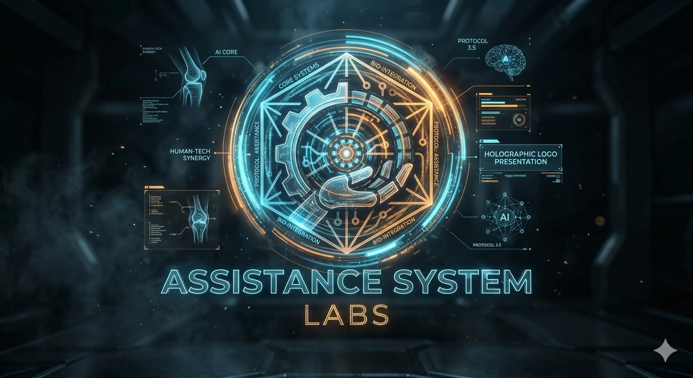

<div align="center">
  

  # 🤖 Assistance System Labs (A.S.L)

  [](https://opensource.org/licenses/MIT)
  [](https://www.python.org/)
  [](https://www.docker.com/)
  [](https://developer.nvidia.com/cuda-toolkit)
  [](CONTRIBUTING.md)

  <br />

  > *"At your service, sir. All systems operational."*
  >
  > **Welcome to Assistance System Labs** — where we turn science fiction into engineering reality. We are an independent research laboratory dedicated to building autonomous, ambient, and deeply intelligent AI assistants that extend human capability.

</div>

---

## 🧬 Who We Are

**Assistance System Labs (ASL)** was founded with a single, ambitious conviction: that the AI assistants depicted in fiction — J.A.R.V.I.S., F.R.I.D.A.Y., and the like — should not remain confined to movie screens. They belong in our homes, our workplaces, our hospitals, and our research labs.

Based in **Etah, Uttar Pradesh, India**, ASL is a multi-disciplinary collective of AI researchers, systems engineers, interface designers, and domain specialists. We do not build chatbots. We architect **autonomous digital minds** — entities that perceive, reason, remember, and act on behalf of their human operators.

Our work is guided by the principle of **Ambient Intelligence (AmI)** : technology so effortlessly woven into the fabric of daily life that it becomes invisible — a seamless cognitive extension of human intent.

| 🧠 Core Attribute | ⚡ What It Means |
|---|---|
| **Autonomous Reasoning** | Multi-step chain-of-thought with real-world tool execution |
| **Persistent Identity** | Memory that spans years, not chat windows |
| **Multi-Modal Perception** | Voice, vision, and IoT telemetry fused into spatial awareness |
| **Edge Sovereignty** | 70B-parameter models running entirely on local hardware |

---

## 🚀 Our Assistant Ecosystem

Every project at ASL is named with purpose. Our naming convention draws from the fictional AI systems that inspired our founding — each name carries a philosophy and a mission.

### 🤖 J.A.R.V.I.S. — *Just A Rather Very Intelligent System*

**Our flagship.** J.A.R.V.I.S. is the central, all-encompassing intelligence that anchors the lab's research. Designed for full system command and organizational oversight, it embodies everything we believe an AI assistant should be.

| Aspect | Capability |
|---|---|
| **Cognitive Architecture** | Monolithic core orchestrating a swarm of decentralized sub-agents |
| **System Reach** | Native OS hooks, kernel-level telemetry, smart-environment automation |
| **Sensory Array** | Simultaneous audio, live video contextualization, and streaming text inference |
| **Memory Fabric** | Episodic scratchpad → Semantic cache → Vectorized long-term state |

> J.A.R.V.I.S. is not a product. It is our laboratory's north star — a continuously evolving research platform that pushes the boundaries of what an assistant can be.

### ⚡ F.R.I.D.A.Y. — *Flexible Real-time Intelligent Digital Assistant System*

A lightweight, low-latency counterpart engineered for edge devices and mobile deployments. Where J.A.R.V.I.S. commands the tower, F.R.I.D.A.Y. operates in the field.

- High-frequency quantized inference on constrained hardware
- Deployed across wearables, drone fleets, and developer workstations
- Designed for sub-100ms response loops

### 🎯 Task-Specific Autonomous Agents

Not every problem requires a full cognitive architecture. Our task-specific agents are lean, focused, and fully autonomous — solving one class of problem exceptionally well.

| Agent | Mission |
|---|---|
| **ASL-DevOps** | Autonomous codebase analysis, CI/CD debugging, structural refactoring |
| **ASL-SecOps** | Real-time threat intelligence, anomaly detection, vulnerability patching |

### 🏥 Domain-Expert Systems

When the stakes involve human lives or financial markets, we deploy fine-tuned transformers with deterministic validation layers — ensuring every output is auditable and reliable.

- **ASL-Medics** — Clinical documentation synthesis, trial correlation, cross-reference analysis
- **ASL-FinTech** — Quantitative market modeling, portfolio risk analytics, macro-trend mapping

---

## 🧱 How It Works — The ASL Cognitive Pipeline

Every assistant we build flows through the same carefully engineered cognitive pipeline. Understanding this architecture is the key to understanding how we think about AI.

```
┌─────────────────────────────────────────┐
│        Human Intent & Sensory Input       │
│     (Voice commands, gestures, context)   │
└──────────────────┬──────────────────────┘
                   ▼
┌─────────────────────────────────────────┐
│     Asynchronous Multi-Modal Ingestion    │
│  Audio → STT │ Vision → CLIP │ IoT → MQTT │
└──────────────────┬──────────────────────┘
                   ▼
┌─────────────────────────────────────────┐
│        ASL Cognitive Router & LLM         │
│  Intent classification → Tool selection   │
│  → Chain-of-thought → Response synthesis  │
└────────┬───────────────────┬────────────┘
         ▼                   ▼
┌──────────────────┐  ┌──────────────────┐
│   Memory Core     │  │  Execution Layer  │
│  ChromaDB / Redis │  │  Microservices    │
│  Episodic + Vector│  │  Shell / API / IoT│
└──────────────────┘  └──────────────────┘
```

---

## 🛠 The Technology We Work With

Our stack is chosen for performance, portability, and the ability to run at the edge. We favor open-source, self-hostable components wherever possible.

| Layer | Technologies |
|---|---|
| **Model R&D** | PyTorch · Hugging Face Transformers · DeepSpeed · QLoRA |
| **Inference** | Ollama · vLLM · TensorRT-LLM · Llama.cpp |
| **Agent Logic** | LangGraph · AutoGen · Custom `asyncio` orchestration loops |
| **Vector Storage** | ChromaDB · Pinecone · Milvus · pgvector |
| **Data Layer** | PostgreSQL · Redis Enterprise · Apache Kafka |
| **Infrastructure** | Docker · Kubernetes · NVIDIA CUDA · Ubuntu Server |

---

## 🔬 What We're Researching

### 🧠 Memory That Lasts

LLMs forget. We're fixing that. Our three-tier memory topology — Episodic Caching, Semantic Similarity Matching, and Chronological Graph Consolidation — allows our assistants to maintain coherent identity and context across months and years of continuous operation.

### ⚡ Intelligence at the Edge

We believe powerful AI should not require a data center. Through aggressive quantization (`INT4`, `FP4`, `GGUF`) and hardware-aware tensor compilation, we run 70B-parameter models at interactive speeds on consumer dual-GPU workstations.

### 🎤 Understanding the Physical World

Our assistants don't just read text. They hear sound, see rooms, and sense environmental telemetry — all fused into unified multi-dimensional embeddings that give them genuine spatial awareness of their operator's surroundings.

---

## 👥 Join Us

Assistance System Labs is an open research community. We welcome collaborators who share our vision of ambient, autonomous, and trustworthy AI.

Before contributing, please review:

1. **Safety** — Any module touching system automation must operate in a sandboxed environment
2. **Observability** — All pipelines must emit structured JSON logs and follow `async`/`await` patterns
3. **Reproducibility** — Performance changes must include benchmark reports

See [`CONTRIBUTING.md`](CONTRIBUTING.md) for the full guide.

---

## 📄 License & Contact

Open-source repositories are distributed under the **MIT License**. Enterprise modules remain under ASL commercial licensing. See [`LICENSE`](LICENSE).

| Channel | Detail |
|---|---|
| 📍 **Location** | Etah, Uttar Pradesh, India — 207001 |
| 📧 **Email** | [assistancesystemlabs@gmail.com](mailto:assistancesystemlabs@gmail.com) |
| 👔 **Team** | AI Architects · Systems Engineers · Interface Designers |

---

<div align="center">

  *"Engineering the digital minds of tomorrow, securing cognitive human sovereignty."*

  **© 2026 Assistance System Labs. All rights reserved.**

</div>